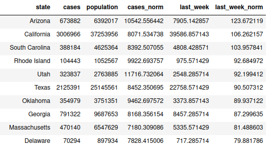

# Reproducing COVID-19 analysis

Data visualization is an incredibly powerful tool that can affect health policy decisions. Ensuring they are easy to interpret, and more importantly, showcase accurate insights from data is paramount for scientific transparency and the health of individuals. For this assignment, we reproduced COVID-19 visualizations and tables published by the [New York Times](https://www.nytimes.com/interactive/2021/us/covid-cases.html). Specifically, we reproduced the following for January 17th, 2021:

1. New cases as a function of time with a rolling average plot
2. Table of cases, hospitalizations and deaths
3. The county-level map for previous week ('Hot spots')
4. Table of cases by state

To reproduce the results, on January 17th, 2023, we downloaded the following data:

- `us-counties.csv` from [here](https://github.com/nytimes/covid-19-data). Contains data for each county. 
- `us-states.csv` from [here](https://github.com/nytimes/covid-19-data). Contains data for each state. 
- `us.csv` from [here](https://github.com/nytimes/covid-19-data). Contains nationwide data. 
- Census of the population from [here](https://cmu-delphi.github.io/covidcast/covidcastR/reference/county_census.html). Data are outdated, we used census of 2010. 

In the following, we present and comment our results. 

## 1. New cases as a function of time with a rolling average plot

## 2. Table of cases, hospitalizations and deaths

## 3. The county-level map for previous week ('Hot spots')

## 4. Table of cases by state

We attempted to reproduce the following figure. 

We obtained the following:

We observe that we could reproduce both the number of cases per state and the average number of cases in the last seven days. When we normalize the results, however, results are different. This is due to the fact that our census data are outdated. When we sort by average number of cases per 100K people in the last week, we don't get exactly the same results, but both standings look similar (e.g. they both have the same top-4 states). 
